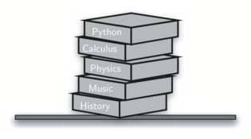
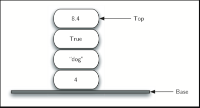
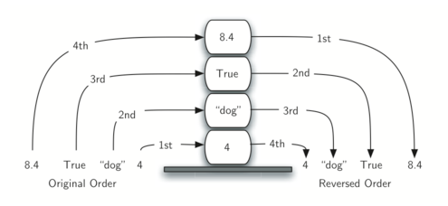

# Stack

## Definition of Stack

Stack is a user defined Data Structure. Stack maintain the data in an ordered fashion way. Stack store items in Last In First Out(LIFO) or First In Last Out (FILO) manner. A stack is a linear data structure.

Here we have an example of a stack of books, to access a book in the stack we will need to remove the ones that are sitting on top of them.

When you place a book one at a time on top of each other, this is a stack. When you want to remove a book you will need to operate a reverse of the order that they were place. The order of insertion is the reverse of the order of removal. 

In programming, putting an item on top of the stack is called push and removing an item is called pop. 

## Stack functions:

| Operation | Performance | Time Complexity |
| --- | --- | --- |
empty() | Returns wheter the stack is empty | O(1)
size() | Returns the size of the stack | O(1)
top() | Returns a reference to the topmost element of the stack | O(1)
push() | Inserts the element at the top of the stack | O(1)
pop() | Deletes the topmost element of the stack | O(1)

