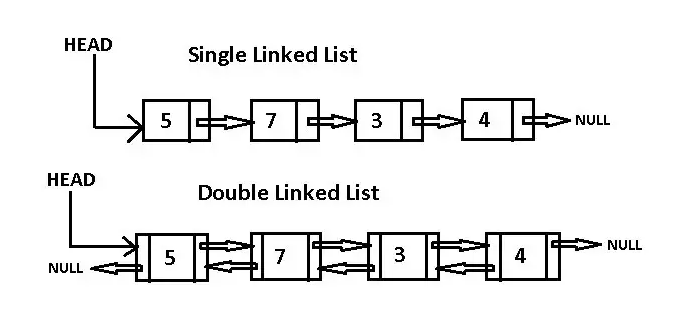

# **Linked List**

## **Definition of Linked List**

Linked list is a sequence data structure, which connects elements, called nodes, through links. Each node stores the data and the address of the next node. 



### **Types of Linked List** 

There are four types of linked lists:
* Single linked list
* Double linked list
* Circular linked list
* Circular Double linked list. 

You have to start somwhere, so we use the address of the first node that is called `HEAD`. The last node in a linked list can be found because it connect the pointer to the next node, which is whenever the pointer to the next node is `NULL`, the list has reached the end of the linked list. The last node in a linked list is call `TAIL`.

A Single *Linked List* is an undirectional linked list. So, you can only traverse it in one direction (from head to tail)

A *Double Linked List* is a bi-directional linked list. This means that you can traverse it in both direction

## **Example of Linked List** 

Some examples of linked list are songs in the music player, they are linked to the next and previous song. Another example is the web browsers, when we access the previous and next URL using the back and forward button, because they are linked using a linked list. 

## **Efficiency of Linked List Operations:**

| Operation | Single-Linked List | Doubly-Linked List |
| --- | --- | --- |
Access an element | O(n) | O(n)
Add/remove at an index position | O(1) | O(1)
Add/remove first element | O(1) | O(1)
Add/remove at middle | O(n) | O(n)
Add last element | O(1) | O(1)
Remove last element | O(1) | O(1)

### Advantages
* Append and delete can be done very quicky in `constant time O(1)`.
* Adding an element at the beggining is done in `constant time O(1)`. 
* Deletion at the beggining is done in `constant time O(1)`. 
* Dynamic size.
* Efficient memory allocation/utilization.

### Disadvantages
* To accessing an element is slow that is `Linear time O(n)`
* Insertion and deletion to the middle of the linked list takes `linear time O(n)`, as iteration over 'n' elements is required to get to the location of the element before inserting or deleting the node. 
* More momory needed per node as additional storage required for pointers. 

## **Implementing a Linked List in Python**

There is not data structure within Python build on to construct linked list. Each item in a linked element is itself a separate object that can be anything and it can contain any information, along with a pointer to the next item in the linked list. 

The first step is to create the constructor, which will be called whenever a linked list is created. 

### _Example of a Single linked list_

```.py
class Node:
    def __init__(self, data):
        self.data = data
        self.next = None

class Linked_list:
    def __init__(self):
    self.head = Node ()
```

* Adding an element using append().

```.py
def append(self, data):
"""
Create the Head of the linked List.
This has a time complexity of O(1).We start by instantiating a new node, assigning the data to the new node, setting the next of the new node to the current head of the list, and then setting the head of the linked list to the new node.
"""
    # Hold the data.
    new_node = Node(data)   

    # set the cur variable to the current head.
    cur = self.head 

```

* Finding an element from the Linked List.

Find an item within the linked list.

* Removing an element from the Linked List.

Remove a given item with a given value.

* Checking if a Linked List is empty.

Returns whether the linked list is empty or not.

* Get the length of a Linked List. 

Returns the number of items in the linked list.


## **Problem to solve**

We are going to implement a simple Single Linked list. We will crate the linked list, then we will add 4 integer numbers, then we will get and element, finally we will delete an element from the linked list 

## **Solution**

[Solution](linked_list.py)
