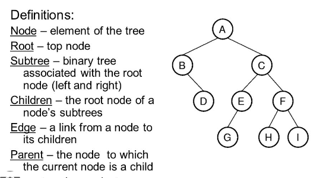
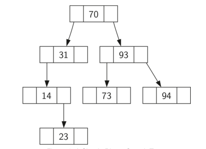

# **Binary Search Tree**

## **Definition of Binary Search Tree**

A binary search tree like a linked list is a set of nodes and allow us to maintain a sorted list of numbers. Each node stores an item, for example for every node (N), all items in its left subtree are smaller than N and all the items in its right subtree are larger than N. It is called binary tree because each node has a maximum of two children. It is called a search tree because it can be used to search a number in O(log n) time. 

## **Example of Binary Search Tree**

A Binary Search Tree is constracted in the following way: 

As look in the image we inserted 7 elements in the Binary Tree, 70, 31, 93, 94, 14, 23, 73. The element 70 was the first item inserted into the tree, this is called the **root**. Next, 31 is less than 70, so it becomes to be inserted to left of 70, this is **left child** of 70. Next, 93 is greater than 70, so it becomes the right **right child** of 70. Here we have completed two levels of the three filled. Next item will be inserted to the left of to the right child of either 31 or 93. Here in our example, 94 is greater than 93 so it becomes the right of 93, we complete the binary tree with this pattern to create a balance binary tree. 