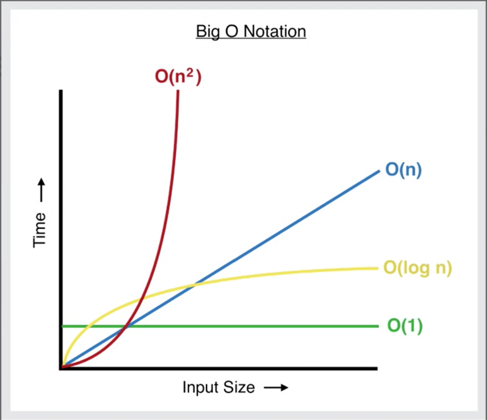

# FINAL PROJECT - DATA STRUCTURES

Welcome to Python Data Structures tutorial. To begin this tutorial I will make a brief
introduction on the meaning of Data Structure, also an explanation of Big O Notation and 
the importance on Data Structures. 

## What is Data Structure?

When you have data that you need to keep organized, you can achieve this
using Data structure. Data Structure is a way to organize data in the computer 
memory so that you can use it effectively. 
Depending on the type of data you have and how you want to retrive your data, 
you'll need to find the right data structure (Access, Insertion, Deletion, Search.
There are different ways to find out if data structure is good for project. The way 
to know it is through Big O Notation. 

## What is it Big O Notacion. 

Big O is a mathematical notacion that represents the worst case run time or space
requirement as input size increases. This could be as the input size grows how 
much longer does your algorithm take to run and how much more space in memory does the 
algorithm need. 

## A programer can create their own data structure, for example, Stack, Queue, Tree, Linked List,Graph, and Hash Map. We will cover three different data structures in this tutorial: 

* ### [Stack](1_stack.md)
* ### [Linked List](2_linkedlist.md)
* ### [Tree](3_tree.md)

## Contact

For questions or comments, please send them to:

Julieta White, BYU-Idaho, CSE 212, Section 4

julietawhite30@gmail.com
